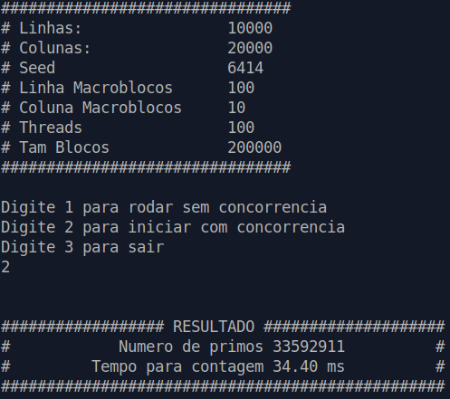

# Work of Operating Systems

this work was made to a operating system discipline, which consists in building a program using two different approaches, one should be linear(single-thread) and another one using multi-threads to speed up the results.  

> All the comments inside the source code its in portuguese, I didn't have time in the moment to translate that part, but I will try to brief what you need to know to run it.

## Finding Prime Number
The matrix below shows the idea of the problem. The matrix was divided in **N** submatrices with equals size but not necessarily they should be squared, they just need to have the same shape.
The threads should use the main matrix without copying it, so the separation has to be only logical.
 

## Running
The executable file was already build for linux, but in case of any modification the make file should be able to build it.  
Just type:
 ~~~ bash
make            #Build the programa
chmod +x main   #Gives permition to execute the file
./main          #Run the program
~~~

The Program has a menu where you can select which approach you want to run.
- 1) for single-thread approach
- 2) for multi-thread approach

The answer will be given in **ms**.

## Changing parameters
If you want to make some changes remember to delete the main executable and run the makefile again. Otherwise the makefile will not overwrite the main program so the changes will not be made.
The mainly configuration was set as a define in **SO_utils.h** file.

## Contact
Any question,concern,bugs and this kind of stuff, just send me an e-mail, I would be glad to help.  
diegoperez ( dot ) ufes ( at ) gmail ( dot ) com
