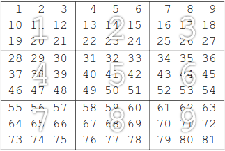

# Work of Operating Systems

this work was made to a operating system discipline, which consists in building a program using two different approaches, one should be linear(single-thread) and another one using multi-threads to speed up the results.  

## Finding Prime Number
The matrix below shows the idea of the problem. The matrix was divided in **N** submatrices with equals size but not necessarily they should be squared, they just need to have the same shape.
The threads should use the main matrix without copying it, so the separation has to be only logical.
 

## Contact
Any question,concern,bugs and this kind of stuff, just send me an e-mail, I would be glad to help.  
diegoperez ( dot ) ufes ( at ) gmail ( dot ) com
